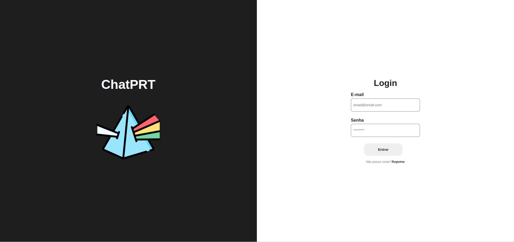
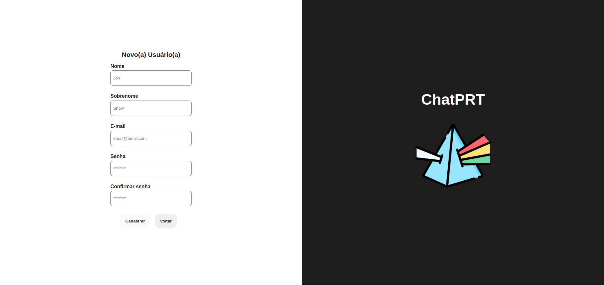
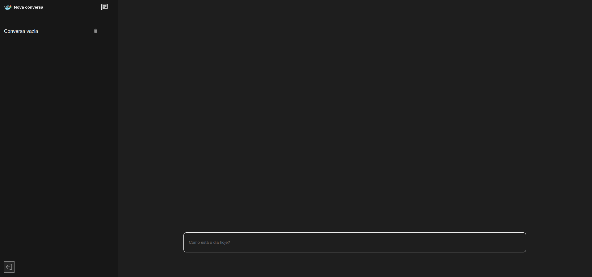
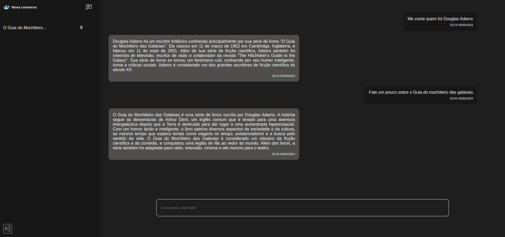
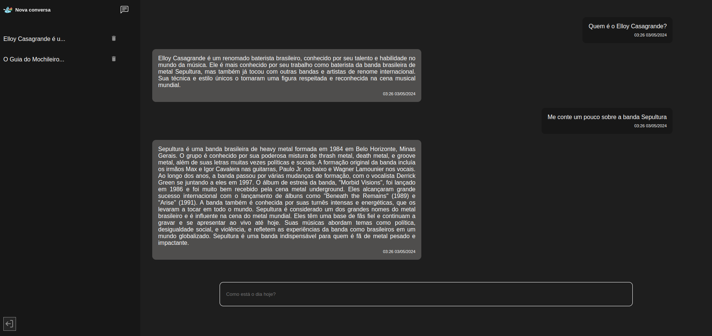

# ChatPRT

Trata-se de um chat em tempo real com a Inteligência Artificial da [OpenAI](https://openai.com/) ChatGPT 3.5. Nele, é possível cadastrar um novo usuário, realizar o login, criar novas conversas, conversar com o ChatGPT, visualizar e remover conversas do histórico de conversas, também como acessá-las do ponto em que parou

### OpenAI

Para a realização desse projeto, foi utilizada a [ferramenta da OpenAI](https://platform.openai.com/docs/introduction), que nos permite integrar seus produtos de Inteligência Artificial aos nossos projetos.

# Sumário
- [Licença](#licenca)
- [Tecnologias utilizadas](#tecnologias)
- [Instruções para rodar o projeto](#instrucoes)
  - [.env](#env)
    - [Backend](#env-backend)
  - [Iniciando a aplicação](#start)
- [Demonstração](#demo)
- [Rotas e autenticação](#rotas)
  - [Verificar saúde da aplicação](#health)
  - [Autenticação](#token)
  - [Criar um novo usuário](#post-user)
  - [Login do usuário](#login)
  - [Criar uma nova mensagem](#post-message)
  - [Buscar conversas pelo id do usuário](#get-conversation)
  - [Criar uma nova conversa](#post-conversation)
  - [Deletar uma conversa](#delete-conversation)
- [Testes](#testes)
  - [Backend](#testes-backend)
- [Banco de dados](#db)
- [Infra](#infra)
  - [Workflows](#workflows)
    - [Application build](#application-build)
    - [Continuous Integration](#ci)
  - [Terraform](#terraform)

## Licença <a name="licenca"></a>
Este projeto está sob licença do [MIT](https://github.com/danielbped/ChatPRT/blob/master/LICENSE)

## Tecnologias utilizadas <a name="tecnologias"></a>
- **[ReactJS](https://react.dev/)**: Uma biblioteca JavaScript de código aberto utilizada para construir interfaces de usuário (UI). Desenvolvida pelo Facebook, ela é baseada em componentes reutilizáveis, permitindo a construção de interfaces dinâmicas e interativas de forma eficiente.
- **[TypeScript](https://www.typescriptlang.org/)**: Um superconjunto de JavaScript que adiciona tipagem estática opcional ao código. Ele ajuda os desenvolvedores a detectar erros mais cedo durante o desenvolvimento e oferece ferramentas avançadas para trabalhar em projetos de grande escala, melhorando a manutenibilidade e escalabilidade do código.
- **[Styled Components](https://styled-components.com/)**: Uma biblioteca para React e React Native que permite escrever estilos CSS diretamente dentro de componentes JavaScript. Isso facilita a criação e o gerenciamento de estilos, além de fornecer recursos como props dinâmicas e escopo encapsulado para estilos.
- **[Axios](https://axios-http.com/ptbr/docs/intro)**: Uma biblioteca JavaScript para fazer requisições HTTP a partir do navegador ou Node.js. Ele fornece uma API simples e concisa para lidar com solicitações e respostas HTTP, suportando várias funcionalidades, como interceptadores, cancelamento de requisições e transformações de dados.
- **[Vite](https://vitejs.dev/)**: Um construtor de aplicações web moderno e rápido, desenvolvido principalmente para projetos usando Vue.js, mas também é compatível com outras estruturas como React e Svelte. Ele oferece um ambiente de desenvolvimento extremamente rápido e eficiente, com recarga rápida (hot module replacement) e suporte a módulos ES.
- **[React Icons](https://react-icons.github.io/react-icons/)**: Uma biblioteca que fornece um conjunto de ícones populares para serem usados em aplicações React. Ela simplifica a inclusão de ícones vetoriais em projetos React, oferecendo uma ampla variedade de ícones e estilos prontos para uso.
- **[React Spinners](https://www.davidhu.io/react-spinners/)**: Uma biblioteca React que fornece componentes para exibir indicadores de carregamento (spinners) em aplicações web. Ela oferece uma variedade de estilos e opções de personalização para spinners, facilitando a inclusão de feedback visual de carregamento em interfaces de usuário.
- **[React Query](https://tanstack.com/query/latest)**: Uma biblioteca para gerenciamento de dados em aplicações React. Ela simplifica o gerenciamento de dados assíncronos, como solicitações HTTP, cache de dados e atualizações em tempo real, fornecendo uma API simples e intuitiva para lidar com esses cenários comuns no desenvolvimento de aplicações web.
- **[Node.js](https://nodejs.org/en/)**: Plataforma de desenvolvimento para construção do ambiente de servidor.
- **[NestJS](https://docs.nestjs.com/)**: Framework web para Node.js utilizado na construção da API.
- **[TypeORM](https://typeorm.io/)**: ORM (Object-Relational Mapping) para TypeScript e JavaScript que simplifica o acesso e manipulação de banco de dados relacionais.
- **[MySQL](https://www.mysql.com/)**: Sistema de gerenciamento de banco de dados relacional utilizado para armazenar os dados da aplicação.
- **[Bcrypt](https://www.npmjs.com/package/bcrypt)**: Biblioteca para hashing de senhas utilizada para armazenar senhas de forma segura.
- **[Jsonwebtoken](https://www.npmjs.com/package/jsonwebtoken)**: Implementação de JSON Web Tokens (JWT) para autenticação de usuários.
- **[Dotenv](https://www.npmjs.com/package/dotenv)**: Módulo que carrega variáveis de ambiente a partir de um arquivo .env para o processo do Node.js.
- **[Cors](https://developer.mozilla.org/pt-BR/docs/Web/HTTP/CORS)**: Middleware para Express que habilita o controle de acesso HTTP (CORS).
- **[Http Status Codes](https://www.npmjs.com/package/http-status-codes)**: Status Codes: Pacote que fornece uma lista de constantes para códigos de status HTTP.
- **[Jest](https://jestjs.io/pt-BR/)**: Framework de teste em JavaScript com foco na simplicidade.
- **[Supertest](https://www.npmjs.com/package/supertest)**: Biblioteca utilizada para testar APIs HTTP.
- **[Uuidv4](https://www.npmjs.com/package/uuidv4)**: Pacote para geração de UUIDs (identificadores únicos universais) versão 4.
- **[Docker](https://docs.docker.com/compose/)**: Uma ferramenta para definir e executar aplicações multi-contêineres. É a chave para desbloquear uma experiência de desenvolvimento e implantação simplificada e eficiente.
- **[Swagger](https://swagger.io/)**: Ferramente utilizada para criar documentações exemplificando a utilização das rotas, de uma forma prática.
- **[OpenAI](https://platform.openai.com/docs/introduction)**: Biblioteca que nos permite integrar seus produtos de Inteligência Artificial aos nossos projetos.
- **[Terraform](https://www.terraform.io/)**: Uma ferramenta de infraestrutura como código (IaC) para provisionar e gerenciar recursos de infraestrutura de forma declarativa. É utilizado para automatizar implantações, oferecendo consistência e confiabilidade.
- **[Google Cloud](https://cloud.google.com/)**: Uma plataforma de computação em nuvem do Google, oferecendo uma ampla gama de serviços para desenvolvimento, armazenamento e implantação de aplicações. Com infraestrutura global e recursos avançados, é uma escolha popular para migrar cargas de trabalho para a nuvem.

# Instruções para rodar o projeto <a name="instrucoes"></a>

### Será necessário ter instalado na sua máquina:

```
  Git
  Docker
```

- Clone o repositório com o comando git clone:

```
  git clone git@github.com:danielbped/ChatPRT.git
```

- Entre no diretório que acabou de ser criado:

```
  cd ChatPRT
```

## .env <a name="env"></a>

Para que a aplicação funcione corretamente, algumas variáveis de ambiente precisam ser configuradas, basta seguir os passos a seguir.

Na raiz do projeto, basta renomear o arquivo .env.example para .env, lá já se encontram todas as variáveis necessárias para iniciar o banco de dados.

### Backend <a name="env-backend"></a>
Na pasta Backend, será necessário criar um arquivo .env, com as seguintes informações:
```
MYSQL_DB_USER=root
MYSQL_DB_NAME=chat-prt
MYSQL_DB_HOST=localhost
MYSQL_DB_PASSWORD=password
MYSQL_DB_ROOT_PASSWORD=password
MYSQL_DB_PORT=3306
SECRET_KEY_JWT=chat-prt
OPENAI_API_URL=https://api.openai.com/v1/chat/completions
OPENAI_PROJECT=
OPENAI_ORGANIZATION=
OPENAI_MODEL=
```

Um arquivo com estas definições já está presente no projeto, o **.env.example**, para que funcione corretamente, basta renomear para apenas **.env**, são responsáveis pela criação do banco de dados. Caso deseje utilizar um banco de dados local ao invés do banco fornecido na imagem do Docker, basta alterar os dados de acordo com os dados de usuário do banco de dados local. Em relação às outras variáveis. Em relação às variáveis relacionadas à plataforma da OpenAI, é necessário que você possua uma conta na [OpenAI](https://platform.openai.com/docs/introduction), com um projeto criado, então o código do projeto irá em **OPENAI_PROJECT** e o código da organização em **OPENAI_ORGANIZATION**. Já em relação ao modelo utilizado, foi o **gpt-3.5-turbo**, mas outros modelos podem ser utilizados, de acordo com as configurações da sua conta. Para mais informações sobre como obter estes dados, [visite](https://platform.openai.com/docs/guides/production-best-practices).

## Iniciando a aplicação <a name="start"></a>

Com as variáveis de ambiente configuradas, basta executar o comando do Docker abaixo para buildar a aplicação:

```
  docker-compose up -d --build
```

Caso tudo tenha dado certo, a seguinte mensagem aparecerá no terminal

```
  [+] Running 5/5
  Network chatprt_backend_network Created
  Network chatprt_frontend_network Created
  Container chatprt-chatprt-db-1  Started
  Container chatprt-chatprt-backend-1  Started
  Container chatprt-chatprt-frontend-1  Started
```

Agora basta acessar a URL http://localhost:8000 para acessar a aplicação, e a URL http://localhost:3000/docs para visualizar as rotas disponíveis da API.

Para derrubar a aplicação e encerrar os containers do Docker, basta rodar o comando abaixo:

```
  docker-compose down
```

# Demonstração <a name="demo"></a>

## Login


## Novo usuário


## Caso em que não há nenhuma conversa cadastrada


## Nova conversa cadastrada


## Primeiras mensagens


## Novas mensagens, mantendo o histórico


<a href="https://www.flaticon.com/br/icones-gratis/prisma" title="prisma ícones">Prisma ícones criados por Freepik - Flaticon</a>

# Rotas e autenticação <a name="rotas"></a>

## Verificar saúde da aplicação <a name="health"></a>
### GET /health

### **Respostas**
  - Status **200** (OK)
    - **Descrição:** Aplicação está saudável e funcionando.
  - Status **500** (Internal Server Error)
    - **Descrição:** Aplicação não está funcionando corretamente. 

## Autenticação <a name="token"></a>

As requisições que envolvem usuário (`POST /user` e `POST /login`) possuem um comportamento semelhante. Ambas irão retornar o usuário logado e um token. **Este token será necessário para as demais rotas**, sendo passado no parâmetro Authorization dos headers das requisições. No seguinte formato `Bearer token`. Por exemplo, se o token for `yJhbGciOiJIUzI1NiIsInR5cCI6IkpXVCJ`, o parâmetro Authorization terá o seguinte valor `Bearer yJhbGciOiJIUzI1NiIsInR5cCI6IkpXVCJ`.

## Criar um novo usuário <a name="post-user"></a>
### POST /users

### **Parâmetros da Requisição**
  
  | Parâmetro   | Tipo     | Descrição              | Exemplo                  |
  |-------------|----------|------------------------|--------------------------|
  | `firstName` | String   | Nome do usuário        | "Douglas"                |
  | `lastName`  | String   | Sobrenome do usuário   | "Adams"                  |
  | `email`     | String   | E-mail do usuário      | "douglasadams@email.com" |
  | `password`  | String   | Senha do usuário       | "s3nh4_f0rt3"            |

### **Respostas**

  - Status **201** (Created)
    - **Descrição:** Criado com sucesso.
    ### Corpo da Resposta:
      ```json
      {
        "token": "yJhbGciOiJIUzI1NiIsInR5cCI6IkpXVCJ",
        "user": {
          "firstName": "Douglas",
          "lastName": "Adams",
          "email": "douglasadams@email.com",
          "id": "123456789",
          "createdAt": "2024-05-02T12:00:00Z",
          "updatedAt": "2024-05-02T12:00:00Z"
        }
      }
      ```

  - Status **400** (Bad Request)
    - **Descrição:** Dados inválidos.

  - Status **500** (Internal Server Error)
    -**Descrição:** Erro interno do sistema.

## Login do usuário <a name="login"></a>
### POST /login

### **Parâmetros da Requisição**
  
  | Parâmetro   | Tipo     | Descrição              | Exemplo                  |
  |-------------|----------|------------------------|--------------------------|
  | `email`     | String   | E-mail do usuário      | "douglasadams@email.com" |
  | `password`  | String   | Senha do usuário       | "s3nh4_f0rt3"            |

### **Respostas**
  - Status **200** (OK)
    - **Descrição:** Sucesso no login.
    ### Corpo da Resposta:
      ```json
      {
        "token": "yJhbGciOiJIUzI1NiIsInR5cCI6IkpXVCJ",
        "user": {
          "firstName": "Douglas",
          "lastName": "Adams",
          "email": "douglasadams@email.com",
          "id": "123456789",
          "createdAt": "2024-05-02T12:00:00Z",
          "updatedAt": "2024-05-02T12:00:00Z"
        }
      }
      ```

  - Status **401** (Unauthorized)
    - **Descrição:** Credenciais inválidas.

  - Status **500** (Internal Server Error)
    - **Descrição:** Erro interno do sistema.

## Criar uma nova mensagem <a name="post-message"></a>
### POST /messages

### **Parâmetros da Requisição**
  
  | Parâmetro     | Tipo     | Descrição                            | Exemplo                                      |
  |---------------|----------|--------------------------------------|----------------------------------------------|
  | `content`     | String   | Conteúdo da mensagem a ser enviada   | "Qual é a resposta para a vida, o universo e tudo mais?" |
  | `conversation`| Object   | Conversation em que a mensagem está inserida | Consulte o exemplo abaixo            |
  
  Exemplo do objeto `conversation`:
  ```json
  {
    "id": "123456789",
    "messages": [],
    "createdAt": "2024-05-02T12:00:00Z",
    "updatedAt": "2024-05-02T12:00:00Z",
    "user": {
      "id": "42",
      "firstName": "Douglas",
      "lastName": "Adams",
      "email": "douglasadams@example.com",
      "createdAt": "2024-05-02T12:00:00Z",
      "updatedAt": "2024-05-02T12:00:00Z"
    }
  }
```

### Respostas
  - Status **201** (Created)
    - **Descrição:** Criado com sucesso.

### Corpo da Resposta:
   
```json
{
  "content": "Qual é a resposta para a vida, o universo e tudo mais?",
  "response": "42",
  "conversation": {
    "id": "123456789",
    "messages": [],
    "createdAt": "2024-05-02T12:00:00Z",
    "updatedAt": "2024-05-02T12:00:00Z",
    "user": {
      "id": "42",
      "firstName": "Douglas",
      "lastName": "Adams",
      "email": "douglasadams@example.com",
      "createdAt": "2024-05-02T12:00:00Z",
      "updatedAt": "2024-05-02T12:00:00Z"
    }
  },
  "id": "123456789",
  "createdAt": "2024-05-02T12:00:00Z",
  "updatedAt": "2024-05-02T12:00:00Z"
}

```
  - Status **401** (Unauthorized)
    - **Descrição:** Usuário não autorizado.
  - Status **400** (Bad Request)
    - **Descrição:** Dados inválidos.
  - Status **500** (Internal Server Error)
    - **Descrição:** Erro interno do sistema.

## Buscar conversas pelo id do usuário <a name="get-conversation"></a>
### GET /conversation/:id

### **Parâmetros da Requisição**
  
  | Parâmetro | Tipo   | Descrição             | Exemplo      |
  |-----------|--------|-----------------------|--------------|
  | `id`      | String | ID do usuário         | "42"         |
  
### **Respostas**

  - Status **200** (OK)
    - **Descrição:** Sucesso.
    ### **Corpo da Resposta:**
      ```json
      [
        {
          "id": "123456789",
          "user": {
            "id": "42",
            "firstName": "Douglas",
            "lastName": "Adams",
            "email": "douglasadams@example.com"
          },
          "messages": [],
          "createdAt": "2024-05-02T12:00:00Z",
          "updatedAt": "2024-05-02T12:00:00Z"
        }
      ]
      ```

  - Status **401** (Unauthorized)
    - **Descrição:** Usuário não autorizado.

  - Status **404** (Not Found)
    - **Descrição:** Usuário não encontrado.

  - Status **400** (Bad Request)
    - **Descrição:** Dados inválidos.

## Criar uma nova conversa <a name="post-conversation"></a>
### POST /conversation

### **Parâmetros da Requisição**
  
  | Parâmetro | Tipo   | Descrição             | Exemplo      |
  |-----------|--------|-----------------------|--------------|
  | `user`    | Object | Usuário participante da conversa | Consulte o exemplo abaixo |

  Exemplo do objeto `user`:
  ```json
  {
    "id": "42",
    "firstName": "Douglas",
    "lastName": "Adams",
    "email": "douglasadams@example.com",
    "createdAt": "2024-05-02T12:00:00Z",
    "updatedAt": "2024-05-02T12:00:00Z"
  }
```

### Respostas
 - Status **201** (Created)
    - **Descrição:** Criado com sucesso.
### **Corpo da Resposta**:
```json
{
  "id": "123456789",
  "user": {
    "id": "42",
    "firstName": "Douglas",
    "lastName": "Adams",
    "email": "douglasadams@example.com",
    "createdAt": "2024-05-02T12:00:00Z",
    "updatedAt": "2024-05-02T12:00:00Z"
  },
  "createdAt": "2024-05-02T12:00:00Z",
  "updatedAt": "2024-05-02T12:00:00Z",
  "messages": []
}
```
- Status **401** (Unauthorized)
  - **Descrição:** Usuário não autorizado.
- Status **400** (Bad Request)
  - **Descrição:** Dados inválidos.

## Deletar uma conversa <a name="delete-conversation"></a>
### DELETE /conversation/:id
### **Parâmetros da Requisição**
  
  | Parâmetro | Tipo   | Descrição             | Exemplo      |
  |-----------|--------|-----------------------|--------------|
  | `id`      | String | ID da conversa        | "123456789"  |

### **Respostas**

  - Status **200** (OK)
    - **Descrição:** Deletado com sucesso.

  - Status **401** (Unauthorized)
    - **Descrição:** Usuário não autorizado.

  - Status **404** (Not Found)
    - **Descrição:** Conversa não encontrada.

  - Status **400** (Bad Request)
    - **Descrição:** Dados inválidos.


Ao rodar a aplicação, você poderá visualizar as rotas disponíveis, também como seus respectivos conteúdos de body e parametros, basta navegar para a rota **http://localhost:3000/docs**, onde está disponível uma documentação exclusiva das rotas, desenvolvida utilizando [Swagger](https://swagger.io/).

## Testes <a name="testes"></a>

### Testes <a name="testes-backend"></a>
A aplicação possui testes unitários de todas as rotas e todos os middlewares, também como testes E2E (End to end) de todas as rotas. Para rodar os testes, basta executar o comando abaixo, no diretório `/Backend`:

```
  npm run test
```

# Banco de dados <a name="db"></a>

O banco de dados foi desenvolvido utilizando **MySQL** com o auxílio da ORM **TypeORM** nas migrations e nas queries. A arquitetura do banco possui três tabelas (User, Message e Conversation), e suas colunas podem ser observadas a seguir:

### User

| Coluna     | Tipo     |
|---------------|----------|
| `id`     | String   |
| `firstName`| String   |
| `lastName`| String   |
| `email`| String   |
| `password`| String   |
| `createdAt`| Date   |
| `updatedAt`| Date   |

### Message

| Coluna     | Tipo     |
|---------------|----------|
| `id`     | String   |
| `conversation`| Conversation   |
| `content`| String   |
| `response`| String  |
| `createdAt`| Date   |
| `updatedAt`| Date   |

### Conversation

| Coluna     | Tipo     |
|---------------|----------|
| `id`     | String   |
| `user`| User   |
| `messages`| Message[]   |
| `createdAt`| Date   |
| `updatedAt`| Date   |

# Infra <a name="infra"></a>

## Workflows <a name="workflows"></a>

Para um melhor fluxo de entrega e integrações contínuas, foram desenvolvidos dois scripts de workflow, que irão funcionar em momentos específicos do desenvolvimento. Ambos os workflows estão disponíveis na pasta [.github](/.github/workflows/).

### Application build <a name="application-build"></a>

Este script é responsável por atualizar as imagens da aplicação no [Docker Hub](https://hub.docker.com/), sempre que houver um push nas branch `master`.

### Continuous Integration <a name="ci"></a>

Este script é responsável por validar a integridade da aplicação e rodar todos os testes automatizados, sempre que um novo Pull Request for aberto.

## Terraform <a name="terraform"></a>

A configuração do Terraform se encontra disponível na pasta [Terraform](/terraform), no arquivo `main` pode-se encontrar toda a configuração de deploy das imagens Docker da aplicação, que são instanciadas no [Cloud Run](https://cloud.google.com/run?hl=pt-BR). Também como a instância do banco de dados MySQL no [Cloud SQL](https://cloud.google.com/sql?hl=pt-BR).